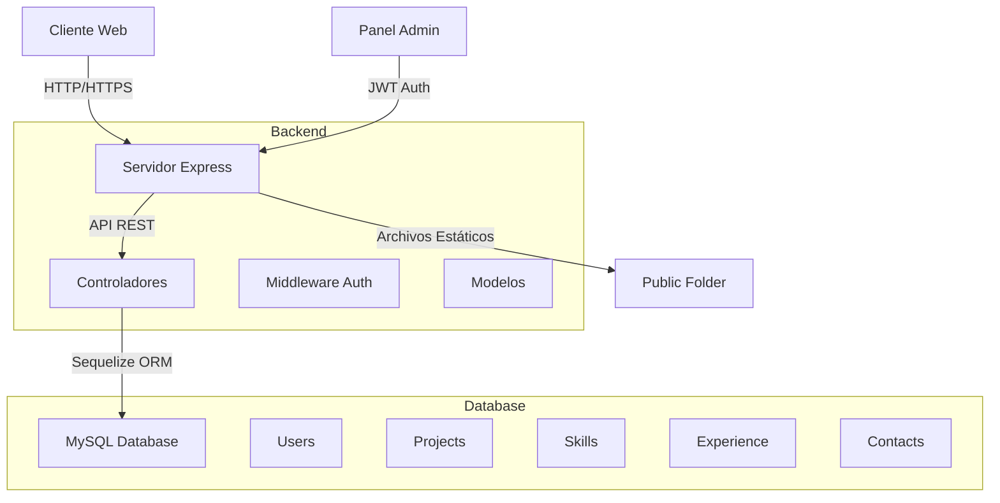

# Documentación Completa - Portfolio MiCV

## Tabla de Contenidos

1. [Introducción](#introducción)
2. [Arquitectura del Sistema](#arquitectura-del-sistema)
3. [Estructura de Carpetas](#estructura-de-carpetas)
4. [Base de Datos](#base-de-datos)
5. [API REST](#api-rest)
6. [Frontend](#frontend)
7. [Panel de Administrador](#panel-de-administrador)
8. [Instalación y Configuración](#instalación-y-configuración)
9. [Seguridad](#seguridad)
10. [Escalabilidad](#escalabilidad)
11. [Troubleshooting](#troubleshooting)

---

## Introducción

Este proyecto es una página web de presentación profesional para una ingeniera junior de desarrollo. Incluye:

- **Frontend moderno** con Bootstrap 5, HTML5, CSS3 y JavaScript vanilla
- **Backend robusto** con Node.js y Express
- **Base de datos MySQL** con Sequelize ORM
- **Panel de administrador** completo con autenticación JWT
- **API REST** para gestión de contenido
- **Arquitectura escalable** lista para producción

### Stack Tecnológico

**Frontend:**
- HTML5
- CSS3 (con efectos glassmorphism y gradientes)
- JavaScript ES6+
- Bootstrap 5.3.2
- Font Awesome 6.5.1

**Backend:**
- Node.js
- Express.js
- Sequelize ORM
- MySQL2

**Seguridad:**
- JWT (JSON Web Tokens)
- bcrypt para hash de contraseñas
- Helmet.js
- CORS

---

## Arquitectura del Sistema

### Diagrama de Arquitectura



### Flujo de Datos

1. **Usuario Público**:
   - Accede a la página principal
   - Visualiza proyectos, habilidades y experiencia (GET público)
   - Envía mensajes de contacto (POST público)

2. **Administrador**:
   - Inicia sesión en `/admin`
   - Recibe token JWT
   - Realiza operaciones CRUD (requieren autenticación)
   - Token se almacena en localStorage

### Capas de la Aplicación

1. **Capa de Presentación** (Frontend)
   - Páginas HTML con Bootstrap
   - Estilos CSS personalizados
   - JavaScript para interactividad

2. **Capa de API** (Backend)
   - Rutas Express
   - Middleware de autenticación
   - Validación de datos

3. **Capa de Lógica de Negocio**
   - Modelos Sequelize
   - Validaciones
   - Relaciones de datos

4. **Capa de Datos**
   - MySQL Database
   - Tablas normalizadas

---

## Estructura de Carpetas

```
micv/
│
├── config/
│   └── database.js          # Configuración de Sequelize y MySQL
│
├── middleware/
│   └── auth.js              # Middleware de autenticación JWT
│
├── models/
│   ├── index.js             # Exportación centralizada de modelos
│   ├── User.js              # Modelo de usuario administrador
│   ├── Project.js           # Modelo de proyectos
│   ├── Skill.js             # Modelo de habilidades
│   ├── Experience.js        # Modelo de experiencia laboral
│   └── Contact.js           # Modelo de mensajes de contacto
│
├── public/
│   ├── admin/
│   │   ├── admin.html       # Página del panel de administrador
│   │   ├── admin.css        # Estilos del panel admin
│   │   └── admin.js         # Lógica del panel admin
│   ├── index.html           # Página principal del portfolio
│   ├── styles.css           # Estilos personalizados
│   └── script.js            # JavaScript principal
│
├── routes/
│   ├── auth.js              # Rutas de autenticación
│   ├── projects.js          # CRUD de proyectos
│   ├── skills.js            # CRUD de habilidades
│   ├── experience.js        # CRUD de experiencia
│   └── contact.js           # Gestión de mensajes
│
├── scripts/
│   └── seed.js              # Script de inicialización de BD
│
├── .env.example             # Ejemplo de variables de entorno
├── .gitignore               # Archivos ignorados por Git
├── package.json             # Dependencias y scripts
├── server.js                # Servidor Express principal
├── README.md                # Documentación rápida
└── documentacion_total.md   # Este archivo
```

---

## Base de Datos

### Esquema de Base de Datos

#### Tabla: `users`

| Campo | Tipo | Descripción |
|-------|------|-------------|
| id | UUID | Identificador único |
| username | VARCHAR(50) | Nombre de usuario (único) |
| email | VARCHAR(100) | Email (único) |
| password | VARCHAR(255) | Contraseña hasheada |
| createdAt | TIMESTAMP | Fecha de creación |
| updatedAt | TIMESTAMP | Fecha de actualización |

#### Tabla: `projects`

| Campo | Tipo | Descripción |
|-------|------|-------------|
| id | UUID | Identificador único |
| title | VARCHAR(200) | Título del proyecto |
| description | TEXT | Descripción detallada |
| technologies | JSON | Array de tecnologías |
| imageUrl | VARCHAR(500) | URL de imagen |
| projectUrl | VARCHAR(500) | URL del proyecto |
| githubUrl | VARCHAR(500) | URL de GitHub |
| featured | BOOLEAN | Proyecto destacado |
| createdAt | TIMESTAMP | Fecha de creación |
| updatedAt | TIMESTAMP | Fecha de actualización |

#### Tabla: `skills`

| Campo | Tipo | Descripción |
|-------|------|-------------|
| id | UUID | Identificador único |
| name | VARCHAR(100) | Nombre de la habilidad |
| category | ENUM | frontend/backend/tools/soft-skills |
| level | INTEGER | Nivel de dominio (1-100) |
| icon | VARCHAR(100) | Clase de icono |
| createdAt | TIMESTAMP | Fecha de creación |
| updatedAt | TIMESTAMP | Fecha de actualización |

#### Tabla: `experience`

| Campo | Tipo | Descripción |
|-------|------|-------------|
| id | UUID | Identificador único |
| company | VARCHAR(200) | Nombre de la empresa |
| position | VARCHAR(200) | Cargo |
| description | TEXT | Descripción del rol |
| startDate | DATE | Fecha de inicio |
| endDate | DATE | Fecha de fin (nullable) |
| current | BOOLEAN | Trabajo actual |
| createdAt | TIMESTAMP | Fecha de creación |
| updatedAt | TIMESTAMP | Fecha de actualización |

#### Tabla: `contacts`

| Campo | Tipo | Descripción |
|-------|------|-------------|
| id | UUID | Identificador único |
| name | VARCHAR(100) | Nombre del contacto |
| email | VARCHAR(100) | Email del contacto |
| subject | VARCHAR(200) | Asunto del mensaje |
| message | TEXT | Contenido del mensaje |
| read | BOOLEAN | Mensaje leído |
| createdAt | TIMESTAMP | Fecha de creación |
| updatedAt | TIMESTAMP | Fecha de actualización |

### Relaciones

Actualmente el esquema no tiene relaciones entre tablas (diseño simple), pero la arquitectura permite agregar relaciones fácilmente. Por ejemplo:

```javascript
// En models/index.js
Project.belongsTo(User, { foreignKey: 'userId' });
User.hasMany(Project, { foreignKey: 'userId' });
```

---

## API REST

### Autenticación

#### POST /api/auth/login

Autenticación de administrador.

**Request:**
```json
{
  "username": "admin",
  "password": "Admin123!"
}
```

**Response (200):**
```json
{
  "success": true,
  "message": "Autenticación exitosa",
  "token": "eyJhbGciOiJIUzI1NiIsInR5cCI6IkpXVCJ9...",
  "user": {
    "id": "uuid",
    "username": "admin",
    "email": "admin@micv.com"
  }
}
```

**Response (401):**
```json
{
  "success": false,
  "message": "Credenciales inválidas"
}
```

---

### Proyectos

#### GET /api/projects

Listar todos los proyectos (público).

**Response (200):**
```json
{
  "success": true,
  "data": [
    {
      "id": "uuid",
      "title": "Portfolio Personal",
      "description": "Descripción del proyecto",
      "technologies": ["HTML5", "CSS3", "JavaScript"],
      "imageUrl": "https://...",
      "projectUrl": "https://...",
      "githubUrl": "https://...",
      "featured": true,
      "createdAt": "2025-01-01T00:00:00.000Z",
      "updatedAt": "2025-01-01T00:00:00.000Z"
    }
  ]
}
```

#### GET /api/projects/:id

Obtener un proyecto específico (público).

#### POST /api/projects

Crear proyecto (requiere autenticación).

**Headers:**
```
Authorization: Bearer <token>
```

**Request:**
```json
{
  "title": "Nuevo Proyecto",
  "description": "Descripción",
  "technologies": ["React", "Node.js"],
  "imageUrl": "https://...",
  "projectUrl": "https://...",
  "githubUrl": "https://...",
  "featured": false
}
```

#### PUT /api/projects/:id

Actualizar proyecto (requiere autenticación).

#### DELETE /api/projects/:id

Eliminar proyecto (requiere autenticación).

---

### Habilidades

#### GET /api/skills

Listar todas las habilidades (público).

**Response (200):**
```json
{
  "success": true,
  "data": [
    {
      "id": "uuid",
      "name": "JavaScript",
      "category": "frontend",
      "level": 80,
      "icon": "fab fa-js",
      "createdAt": "2025-01-01T00:00:00.000Z",
      "updatedAt": "2025-01-01T00:00:00.000Z"
    }
  ]
}
```

#### POST /api/skills

Crear habilidad (requiere autenticación).

**Request:**
```json
{
  "name": "React",
  "category": "frontend",
  "level": 75,
  "icon": "fab fa-react"
}
```

#### PUT /api/skills/:id

Actualizar habilidad (requiere autenticación).

#### DELETE /api/skills/:id

Eliminar habilidad (requiere autenticación).

---

### Experiencia

#### GET /api/experience

Listar experiencia laboral (público).

#### POST /api/experience

Crear experiencia (requiere autenticación).

**Request:**
```json
{
  "company": "Tech Solutions",
  "position": "Desarrolladora Frontend Jr",
  "description": "Desarrollo de interfaces...",
  "startDate": "2023-01-15",
  "endDate": null,
  "current": true
}
```

#### PUT /api/experience/:id

Actualizar experiencia (requiere autenticación).

#### DELETE /api/experience/:id

Eliminar experiencia (requiere autenticación).

---

### Contacto

#### GET /api/contact

Listar mensajes de contacto (requiere autenticación).

#### POST /api/contact

Enviar mensaje de contacto (público).

**Request:**
```json
{
  "name": "Juan Pérez",
  "email": "juan@example.com",
  "subject": "Consulta",
  "message": "Hola, me gustaría..."
}
```

#### PUT /api/contact/:id/read

Marcar mensaje como leído (requiere autenticación).

#### DELETE /api/contact/:id

Eliminar mensaje (requiere autenticación).

---

## Frontend

### Página Principal (index.html)

#### Secciones

1. **Hero Section**: Presentación principal con call-to-action
2. **About**: Información sobre la ingeniera
3. **Skills**: Habilidades técnicas y soft skills
4. **Projects**: Portafolio de proyectos
5. **Experience**: Experiencia laboral en timeline
6. **Contact**: Formulario de contacto

#### Características

- **Responsive**: Adaptable a todos los dispositivos
- **Tema claro/oscuro**: Toggle entre temas
- **Animaciones**: Efectos on-scroll
- **Glassmorphism**: Efectos de vidrio esmerilado
- **Gradientes**: Colores vibrantes

### Estilos (styles.css)

#### Variables CSS

```css
:root {
    --primary: #667eea;
    --secondary: #764ba2;
    --gradient-1: linear-gradient(135deg, #667eea 0%, #764ba2 100%);
    --glass-bg: rgba(255, 255, 255, 0.1);
}
```

#### Componentes Principales

- `.glass-card`: Tarjetas con efecto glassmorphism
- `.gradient-text`: Texto con gradiente
- `.floating-card`: Animación flotante
- `.timeline-item`: Items de línea de tiempo

### JavaScript (script.js)

#### Funcionalidades

1. **Theme Toggle**: Cambio de tema claro/oscuro
2. **Smooth Scroll**: Navegación suave
3. **Intersection Observer**: Animaciones on-scroll
4. **API Integration**: Carga dinámica de datos
5. **Form Validation**: Validación de formulario de contacto

---

## Panel de Administrador

### Acceso

- **URL**: `http://localhost:3000/admin`
- **Credenciales por defecto**:
  - Usuario: `admin`
  - Contraseña: `Admin123!`

### Funcionalidades

#### 1. Autenticación

- Login con JWT
- Token almacenado en localStorage
- Sesión persistente
- Logout

#### 2. Gestión de Proyectos

- Listar proyectos
- Crear nuevo proyecto
- Editar proyecto existente
- Eliminar proyecto
- Marcar como destacado

#### 3. Gestión de Habilidades

- Listar habilidades por categoría
- Crear nueva habilidad
- Editar nivel y categoría
- Eliminar habilidad

#### 4. Gestión de Experiencia

- Listar experiencia laboral
- Agregar nueva experiencia
- Editar fechas y descripción
- Marcar trabajo actual
- Eliminar experiencia

#### 5. Mensajes de Contacto

- Ver mensajes recibidos
- Marcar como leído
- Eliminar mensajes
- Indicador de mensajes nuevos

### Interfaz

- **Sidebar**: Navegación entre secciones
- **Tablas**: Listado de datos con Bootstrap
- **Modals**: Formularios para crear/editar
- **Alerts**: Notificaciones de acciones

---

## Instalación y Configuración

### Paso 1: Requisitos Previos

Asegúrate de tener instalado:

- Node.js v14+
- MySQL v5.7+
- npm o yarn

### Paso 2: Clonar/Navegar al Proyecto

```bash
cd "c:\Users\USUARIO\Documents\pruebas py\micv"
```

### Paso 3: Instalar Dependencias

```bash
npm install
```

Esto instalará:
- express
- sequelize
- mysql2
- bcrypt
- jsonwebtoken
- dotenv
- cors
- helmet
- express-validator
- nodemon (dev)

### Paso 4: Configurar MySQL

1. Inicia MySQL
2. Crea la base de datos:

```sql
CREATE DATABASE portfolio_db CHARACTER SET utf8mb4 COLLATE utf8mb4_unicode_ci;
```

3. Crea un usuario (opcional):

```sql
CREATE USER 'portfolio_user'@'localhost' IDENTIFIED BY 'password';
GRANT ALL PRIVILEGES ON portfolio_db.* TO 'portfolio_user'@'localhost';
FLUSH PRIVILEGES;
```

### Paso 5: Configurar Variables de Entorno

1. Copia `.env.example` a `.env`:

```bash
copy .env.example .env
```

2. Edita `.env`:

```env
PORT=3000
NODE_ENV=development

DB_HOST=localhost
DB_PORT=3306
DB_NAME=portfolio_db
DB_USER=root
DB_PASSWORD=tu_contraseña_mysql

JWT_SECRET=genera_un_secreto_seguro_aqui
JWT_EXPIRES_IN=24h

ADMIN_USERNAME=admin
ADMIN_EMAIL=admin@micv.com
ADMIN_PASSWORD=Admin123!
```

> **Tip**: Para generar un JWT_SECRET seguro:
> ```bash
> node -e "console.log(require('crypto').randomBytes(32).toString('hex'))"
> ```

### Paso 6: Inicializar Base de Datos

```bash
npm run seed
```

Este comando:
- Crea todas las tablas
- Crea el usuario administrador
- Inserta datos de ejemplo
- Muestra las credenciales de acceso

**Guarda las credenciales mostradas en la consola.**

### Paso 7: Iniciar el Servidor

**Desarrollo:**
```bash
npm run dev
```

**Producción:**
```bash
npm start
```

### Paso 8: Verificar Instalación

1. Abre `http://localhost:3000` - Deberías ver la página principal
2. Abre `http://localhost:3000/admin` - Deberías ver el login
3. Inicia sesión con las credenciales del seed

---

## Seguridad

### Medidas Implementadas

#### 1. Autenticación JWT

- Tokens firmados con secreto
- Expiración configurable (24h por defecto)
- Verificación en cada request protegido

#### 2. Hash de Contraseñas

- bcrypt con salt rounds = 10
- Hash automático en hooks de Sequelize
- Nunca se almacenan contraseñas en texto plano

#### 3. Helmet.js

Protección contra vulnerabilidades comunes:
- XSS
- Clickjacking
- MIME sniffing
- etc.

#### 4. CORS

- Configurado para permitir orígenes específicos
- Ajustable para producción

#### 5. Validación de Datos

- Validación en modelos Sequelize
- Validación en rutas con express-validator
- Sanitización de inputs

### Mejores Prácticas

#### Para Producción

1. **Cambiar credenciales por defecto**
   ```sql
   UPDATE users SET password = 'nueva_contraseña_hasheada' WHERE username = 'admin';
   ```

2. **Usar variables de entorno seguras**
   - No commitear `.env`
   - Usar secretos fuertes
   - Rotar tokens periódicamente

3. **HTTPS**
   - Usar certificado SSL/TLS
   - Redirigir HTTP a HTTPS

4. **Rate Limiting**
   - Implementar límite de requests
   - Proteger contra brute force

5. **Logging**
   - Registrar intentos de login
   - Monitorear actividad sospechosa

---

## Escalabilidad

### Arquitectura Actual

La aplicación está diseñada para escalar fácilmente:

#### 1. Base de Datos

**Actual**: MySQL en servidor local

**Escalabilidad**:
- Migrar a MySQL en la nube (AWS RDS, Google Cloud SQL)
- Implementar réplicas de lectura
- Configurar backups automáticos
- Usar connection pooling (ya implementado)

```javascript
// config/database.js ya tiene pool configurado
pool: {
  max: 5,
  min: 0,
  acquire: 30000,
  idle: 10000
}
```

#### 2. Servidor

**Actual**: Servidor Express único

**Escalabilidad**:
- Usar PM2 para clustering
- Load balancer (nginx)
- Contenedores Docker
- Kubernetes para orquestación

**Ejemplo con PM2**:
```bash
npm install -g pm2
pm2 start server.js -i max
```

#### 3. Archivos Estáticos

**Actual**: Servidos por Express

**Escalabilidad**:
- CDN (CloudFlare, AWS CloudFront)
- S3 para imágenes
- Compresión gzip

#### 4. Caché

**Implementar**:
- Redis para sesiones
- Caché de queries frecuentes
- Caché de respuestas API

```javascript
// Ejemplo con Redis
const redis = require('redis');
const client = redis.createClient();

// Cachear proyectos
app.get('/api/projects', async (req, res) => {
  const cached = await client.get('projects');
  if (cached) return res.json(JSON.parse(cached));
  
  const projects = await Project.findAll();
  await client.setex('projects', 3600, JSON.stringify(projects));
  res.json(projects);
});
```

### Migración a Producción

#### Opción 1: VPS (DigitalOcean, Linode)

1. Configurar servidor Ubuntu
2. Instalar Node.js y MySQL
3. Configurar nginx como reverse proxy
4. Usar PM2 para process management
5. Configurar SSL con Let's Encrypt

#### Opción 2: PaaS (Heroku, Railway)

1. Crear cuenta en plataforma
2. Conectar repositorio Git
3. Configurar variables de entorno
4. Usar addon de MySQL
5. Deploy automático

#### Opción 3: Serverless (Vercel, Netlify)

1. Frontend en Vercel/Netlify
2. Backend en AWS Lambda o Vercel Functions
3. Base de datos en PlanetScale o AWS RDS

### Monitoreo y Logs

**Herramientas recomendadas**:
- PM2 logs
- Winston para logging estructurado
- Sentry para error tracking
- New Relic o DataDog para APM

---

## Troubleshooting

### Problemas Comunes

#### 1. Error de Conexión a MySQL

**Síntoma**:
```
Error: connect ECONNREFUSED 127.0.0.1:3306
```

**Solución**:
- Verificar que MySQL esté corriendo
- Verificar credenciales en `.env`
- Verificar puerto (3306 por defecto)

```bash
# Windows
net start MySQL80

# Verificar status
mysql -u root -p
```

#### 2. Token JWT Inválido

**Síntoma**:
```json
{
  "success": false,
  "message": "Token inválido"
}
```

**Solución**:
- Verificar que JWT_SECRET sea el mismo
- Limpiar localStorage y volver a login
- Verificar que el token no haya expirado

#### 3. Error al Crear Tablas

**Síntoma**:
```
Error: Table 'portfolio_db.users' doesn't exist
```

**Solución**:
```bash
# Ejecutar seed nuevamente
npm run seed
```

#### 4. Puerto 3000 en Uso

**Síntoma**:
```
Error: listen EADDRINUSE: address already in use :::3000
```

**Solución**:
```bash
# Windows
netstat -ano | findstr :3000
taskkill /PID <PID> /F

# O cambiar puerto en .env
PORT=3001
```

#### 5. Módulos no Encontrados

**Síntoma**:
```
Error: Cannot find module 'express'
```

**Solución**:
```bash
# Reinstalar dependencias
rm -rf node_modules
npm install
```

#### 6. CORS Error en Frontend

**Síntoma**:
```
Access to fetch at 'http://localhost:3000/api/...' has been blocked by CORS policy
```

**Solución**:
- Verificar que CORS esté habilitado en server.js
- Verificar origen en configuración CORS

#### 7. Contraseña no Coincide

**Síntoma**: No puedo iniciar sesión con credenciales del seed

**Solución**:
- Verificar que usaste las credenciales exactas del output del seed
- Ejecutar seed nuevamente (esto recreará las tablas)
- Verificar que no haya espacios en usuario/contraseña

### Logs y Debugging

#### Ver Logs del Servidor

```bash
# Con nodemon (desarrollo)
npm run dev

# Con PM2 (producción)
pm2 logs
```

#### Debugging en VS Code

Crear `.vscode/launch.json`:

```json
{
  "version": "0.2.0",
  "configurations": [
    {
      "type": "node",
      "request": "launch",
      "name": "Debug Server",
      "skipFiles": ["<node_internals>/**"],
      "program": "${workspaceFolder}/server.js"
    }
  ]
}
```

---

## Contacto y Soporte

Para preguntas o problemas:

1. Revisar esta documentación
2. Revisar logs del servidor
3. Verificar configuración de `.env`
4. Consultar documentación de dependencias

---

## Licencia

ISC

---

**Última actualización**: 2025-11-21

**Versión**: 1.0.0
